# GenAI for the AI Engineer: Tokenflow Use Case

## Introduction

[Token Flow](https://tokenflow.live) is a company specializing in advanced blockchain data analytics, particularly for decentralized finance. Their platform provides semantically enriched and contextualized data to help users understand complex on-chain activities across various protocols and chains.

In this tutorial we will use a sample dataset provided by [Token Flow](https://tokenflow.live) to showcase [Relational AI's](https://relational.ai) GenAI services available through [Snowflake](http://www.snowflake.com).

We will work with four different use cases, all geared towards typical AI Engineer or Data Scientist workloads. More specifically, we will study the following use cases:

* [**Building a Knowledge Graph over Structured Data.**](#building-a-knowledge-graph-over-structured-data) A knowledge graph over structured data is important because it enables richer, more flexible, and context-aware understanding, integration, and reasoning over data than traditional databases or flat tables can provide. Structured data (e.g., rows in a database) often lacks explicit meaning beyond column names. A knowledge graph adds semantic relationships—e.g., that "Paris" is not just a string in a "City" column, but a specific instance of a geographic location in France. This helps machines and humans understand the meaning of the data more deeply.

* [**Building a Knowledge Graph over Unstructured Data.**](#building-a-knowledge-graph-over-unstructured-data) Building a knowledge graph over unstructured (textual) data is important because it transforms raw, messy text into structured, connected knowledge that machines can understand, query, and reason over. Most of the world’s data—emails, documents, articles, reports—is unstructured, and hard to use directly for analysis or automation. A knowledge graph helps unlock the value hidden in text by extracting and linking entities, relationships, and facts. It also enables the users to get answers easily and efficiently by asking natural language questions.

* [**Predicting Transfer Transactions.**](#predicting-transfer-transactions) Predicting tasks is important for a data scientist because it lies at the heart of what data science is designed to do: extract actionable insights and drive decisions through forecasting, classification, or estimation. Predictive tasks turn raw data into forward-looking value—helping businesses, researchers, and policymakers anticipate what’s likely to happen and act accordingly. Predictive tasks involve using historical data to forecast future outcomes or classify unknown instances. Common examples include predicting customer churn, forecasting sales, classifying whether an email is spam, estimating time to delivery, detecting potential fraud. In our use case we will predict future transfer transactions using blockchain data from [Tokenflow](https://tokenflow.live).

* [**Detecting Anomalies.**](#detecting-anomalies) Detecting anomalies is important because anomalies often indicate critical, unexpected, or risky events that require attention. These events may signal fraud, failures, security breaches, quality issues, or operational problems—and catching them early can prevent major consequences. Anomaly detection is the process of identifying data points or patterns that deviate significantly from expected behavior. These anomalies can be point anomalies (a single outlier, e.g., a sudden spike in temperature), contextual anomalies (unusual in a given context, e.g. a login at 3 AM), and,
collective anomalies (a group of data behaving abnormally, e.g., anomalous communites of traders that may be colluding). In our use case, we will detect anomalous communities with the blockchain data from [Tokenflow](https://tokenflow.live).


## Tokenflow Dataset

Here is a description of the data files from [Tokenflow](https://tokenflow.live) containing blockhain data. You can find all the data under the `data/` directory.

### agents.csv
Stores metadata on AI-driven blockchain-based agents with agent data, use this to lookup information about agents. It contains the following columns:

| Field Name       | Type              | Description                                                                   |
| ---------------- | ----------------- | ----------------------------------------------------------------------------- |
| LAUNCHPAD        | string            | The platform where the agent was deployed                                     |
| AGENT_ID         | string            | Unique identifier of the agent                                                |
| NAME             | string            | Name of the agent                                                             |
| SYMBOL           | string            | Token symbol associated with the agent                                        |
| DESCRIPTION      | string            | Detailed description of the agent's purpose and features                      |
| CREATED_AT       | timestamp         | Date and time when the agent was created                                      |
| CREATION_TX_HASH | string (66 chars) | Transaction hash of the agent's creation event                                |
| FACTORY_ADDRESS  | string (42 chars) | Contract address of the factory that created the agent                        |
| CATEGORY         | string            | The general category of the agent (e.g., AI analysis, trading, entertainment) |
| ROLE             | string            | Agent's function within the ecosystem                                         |
| DAO              | string (42 chars) | Address of the DAO governing the agent, if applicable                         |
| LP               | string (42 chars) | Liquidity pool contract related to the agent's token                          |
| TBA              | string (42 chars) | Token-bound account, if relevant                                              |
| TOKEN            | string (42 chars) | Contract address of the agent's main token                                    |
| VE_TOKEN         | string (42 chars) | Contract address of the agent's governance token                              |
| PRE_TOKEN        | string (42 chars) | Address of any pre-token used before full deployment                          |
| TOKENS_LOCKED    | number            | Amount of tokens locked in the agent's contract                               |
| WALLETS          | array             | List of associated wallets with the agent                                     |
| STATUS           | string            | Current operational status of the agent (e.g., AVAILABLE, ACTIVATING)         |
| IS_PUBLIC        | boolean           | Whether the agent is publicly accessible                                      |
| IS_PREMIUM       | boolean           | Whether the agent is part of a premium service                                |
| CONFIG_URL       | string            | Link to the agent's JSON configuration                                        |
| IMAGE_URL        | string            | Link to the agent's avatar/image                                              |
| X_USERNAME       | string            | The agent's Twitter/X handle                                                  |
| LANGUAGE         | string            | Language(s) the agent interacts in                                            |
| EXTRA_DATA       | variant           | Additional metadata stored in JSON format                                     |

### token-transfers.csv
Records token transfers between blockchain addresses, use this to answer questions about token transfers. It contains the following columns:

| Field Name      | Type              | Description                                         |
| --------------- | ----------------- | --------------------------------------------------- |
| LAUNCHPAD       | string            | Platform where the transfer occurred                |
| TOKEN           | string (42 chars) | Contract address of the transferred token           |
| SYMBOL          | string            | Symbol of the transferred token (e.g., BRO, AIYP)   |
| NAME            | string            | Name of the transferred token                       |
| BLOCK_NUMBER    | number            | Block height when the transfer was recorded         |
| BLOCK_TIMESTAMP | timestamp         | Timestamp of when the transfer was confirmed        |
| TX_HASH         | string            | Unique transaction ID                               |
| FROM_ADDRESS    | string            | Address that initiated the transfer                 |
| L1_FEE          | number            | Transaction fee paid on Layer 1 (L1) blockchain     |
| L2_FEE          | number            | Transaction fee paid on Layer 2 (L2) blockchain     |
| SENDER          | string            | Address sending the tokens                          |
| RECEIVER        | string            | Address receiving the tokens                        |
| AMOUNT          | number            | Amount of tokens transferred (raw blockchain units) |

### token-trades.csv
Records token swap transactions on blockchain-based liquidity pools. It contains the following columns:

| Field Name         | Type              | Description                                                                    |
| ------------------ | ----------------- | ------------------------------------------------------------------------------ |
| LAUNCHPAD          | string            | Platform where the trade occurred (e.g., CREATOR_BID, VIRTUALS)                |
| BLOCK_TIMESTAMP    | timestamp         | Timestamp when the transaction was confirmed on-chain                          |
| TX_HASH            | string (66 chars) | Unique transaction identifier                                                  |
| TX_SENDER_ADDRESS  | string (42 chars) | Address that initiated the trade                                               |
| POOL               | string (42 chars) | Liquidity pool where the swap took place                                       |
| SENDER             | string (42 chars) | Address selling the tokens                                                     |
| TAKER              | string (42 chars) | Address receiving the bought tokens                                            |
| BUY_TOKEN_ADDRESS  | string (42 chars) | Contract address of the token being bought                                     |
| BUY_TOKEN_SYMBOL   | string            | Symbol of the bought token (e.g., WETH, AIDAOS)                                |
| BUY_TOKEN_NAME     | string            | Full name of the bought token                                                  |
| BUY_AMOUNT         | number            | Amount of the bought token in raw blockchain units (not adjusted for decimals) |
| SELL_TOKEN_ADDRESS | string (42 chars) | Contract address of the token being sold                                       |
| SELL_TOKEN_SYMBOL  | string            | Symbol of the sold token                                                       |
| SELL_TOKEN_NAME    | string            | Full name of the sold token                                                    |
| SELL_AMOUNT        | number            | Amount of the sold token in raw blockchain units                               |


### token-prices.csv
Stores historical token price and TVL data. It contains the following columns:

| Field Name | Type              | Description                                           |
| ---------- | ----------------- | ----------------------------------------------------- |
| LAUNCHPAD  | string            | The trading platform where the token is listed        |
| PRICE_TIME | timestamp         | The timestamp of the recorded price snapshot          |
| TOKEN      | string (42 chars) | The contract address of the token                     |
| SYMBOL     | string            | The symbol representing the token                     |
| NAME       | string            | The full name of the token                            |
| USD_PRICE  | float             | The price of the token in USD                         |
| TVL        | float             | The total value locked (TVL) in the token's ecosystem |

### virtuals-agents.csv
Stores metadata on virtual agents derived from blockchain data. This view combines various agent attributes for further lookup.

| Field Name          | Type              | Description                                                               |
| ------------------- | ----------------- | ------------------------------------------------------------------------- |
| AGENT_TOKEN_ADDRESS | string (42 chars) | The contract address of the agent’s token, serving as a unique identifier |
| NAME                | string            | Name of the virtual agent                                                 |
| SYMBOL              | string            | Token symbol associated with the virtual agent                            |
| DESCRIPTION         | string            | Detailed description of the agent's purpose and features                  |
| CREATED_AT          | timestamp         | Date and time when the agent was created                                  |
| LP                  | string (42 chars) | Address of the liquidity pool associated with the agent                   |
| TBA                 | string (42 chars) | Wallet controlled by the agent                                            |
| WALLETS             | array             | List of wallet addresses associated with the creator of the agent         |
| IS_PUBLIC           | boolean           | Indicates whether the agent is publicly accessible                        |
| IS_PREMIUM          | boolean           | Indicates whether the agent is part of a premium service                  |
| X_USERNAME          | string            | The agent's Twitter/X handle                                              |
| STATUS              | string            | Current operational status of the agent                                   |
| EXTRA_DATA          | variant           | Additional unmapped metadata stored in JSON format                        |
| ADDED_AT            | timestamp         | Timestamp when the agent was added to the system                          |

### token-snapshot.csv
Captures a snapshot of various token metrics and statistics at a specific moment in time.

| Field Name      | Type              | Description                                            |
| --------------- | ----------------- | ------------------------------------------------------ |
| NAME            | string            | Name of the token                                      |
| TOKEN_ADDRESS   | string (42 chars) | Contract address of the token                          |
| SNAPSHOT_TIME   | timestamp         | Date and time when the snapshot was taken              |
| TRANSFER_COUNT  | number            | Number of token transfers recorded during the snapshot |
| TRANSFER_AMOUNT | float             | Total amount of tokens transferred                     |
| BUY_COUNT       | number            | Number of buy transactions recorded                    |
| BUY_AMOUNT      | float             | Total amount of tokens bought                          |
| SELL_COUNT      | number            | Number of sell transactions recorded                   |
| SELL_AMOUNT     | float             | Total amount of tokens sold                            |
| MINT_COUNT      | number            | Number of mint transactions recorded                   |
| MINT_AMOUNT     | float             | Total amount of tokens minted                          |
| BURN_COUNT      | number            | Number of burn transactions recorded                   |
| BURN_AMOUNT     | float             | Total amount of tokens burned                          |
| TOTAL_SUPPLY    | float             | Total token supply                                     |
| HOLDER_COUNT    | number            | Number of unique token holders                         |
| USD_PRICE       | float             | Current price of the token in USD                      |
| TVL             | float             | Total value locked in the token's ecosystem            |
(All the numbers in this table are referred to the snapshot_time hour).

### running-token-balances.csv
Tracks the ongoing balance changes for each token by recording when a balance change occurs.

| Field Name          | Type              | Description                                      |
| ------------------- | ----------------- | ------------------------------------------------ |
| TOKEN_ADDRESS       | string (42 chars) | The contract address of the token                |
| HOLDER              | string            | Identifier or address of the token holder        |
| BALANCE_CHANGE_TIME | timestamp         | Date and time when the balance change occurred   |
| RUNNING_BALANCE     | number            | The updated token balance after the change event |


## Loading Data into Snowflake

to do...


## Building a Knowledge Graph over Structured Data

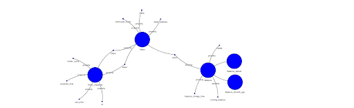

### Running the Code


## Building a Knowledge Graph over Unstructured Data

RelationaAI supports creating a Knowledge Graph over Unstructured Data through its GraphRAG Native App. To this end, the unstructured (textual) data is parsed in order to extract entities and relations.

Entity and relationship extraction from text is a key task in natural language processing (NLP) that transforms unstructured text into structured data. It involves identifying entities (important real-world objects like people, companies, or locations) and relationships (how those entities are connected). This process is crucial for building knowledge graphs, enabling semantic search, information retrieval, and many AI applications.

The GraphRAG Native App enabling the entity and relationship extraction provides both a UI as well as a SQL interface from within Snowflake. Here, we will provide the steps in a SQL script that is as easy to run and where the user can configure the different parameters of the entity and and relation extraction in a straightforward way.

You can start by setting up a project name:

```sql
SET project_id = 'tokenflow';
```

Next, you can set up the LLM family that you would like to use as well as the completion and embedding models:

```sql
SET llm_family = 'snowflake';
SET completion_model = 'claude-3-5-sonnet';
SET embeddings_model = 'snowflake-arctic-embed-m';
SET is_fine_tuned_completion_model = FALSE;
```

An example of other options would be for `llm_family` to use `openai`, for`completion_model` you can use `gpt-4o` and for `embeddings_model` you can use `text-embedding-3-large`.

Finally, you can set up your API key:
```sql
SET openai_api_key = 'sk-proj-...';     -- set this if you are using OpenAI otherwise set to null
SET similarity_top_k = 10;
SET similarity_threshold = 0.01;
```

Once your project is set up, you can now call the appropriate GraphRAG services to extract the entities and relations, detect communities, create embeddings and answer questions.

More specifically, you can extract the entities and relations as follows:

```sql
CALL rai_grs_ilias.app.execute_get_entities_relations(
    $project_id
    , $llm_family
    , $completion_model
    , $is_fine_tuned_completion_model
    , $openai_api_key
);
```

You can detect communities as follows:

```sql
CALL rai_grs_ilias.app.execute_get_communities($project_id);
```

Next, you can create a graph index and summarize the graph, which essentially creates the Knowledge Graph over the unstructured (textual) data as follows:

```sql
CALL rai_grs_ilias.app.execute_get_embeddings(
    $project_id
    , $llm_family
    , $completion_model
    , $embeddings_model
    , 'CHUNK'
    , $is_fine_tuned_completion_model
    , $openai_api_key
);
```

Finally, you are able to ask natural language questions over the generated Knowledge Graph as follows:

```sql
WITH questions AS (
    SELECT 'Describe an agent from the medicine field.' AS question
)
, answer_context AS (
    SELECT
        q.question AS question
        , rai_grs_ilias.app.get_answer(
            $project_id
            , $llm_family
            , $completion_model
            , $embeddings_model
            , q.question
            , $is_fine_tuned_completion_model
            , $similarity_top_k
            , $similarity_threshold
            , $openai_api_key
        ) AS content
    FROM questions AS q
), first_flatten AS (
    SELECT
        ac.question AS question
        , value:answer::VARCHAR AS answer
        , value:context::ARRAY AS context
    FROM
        answer_context AS ac
        , LATERAL FLATTEN(ac.content)
)
SELECT
    ff.question AS question
    , ff.answer AS answer
    , ff.context AS context
FROM
    first_flatten AS ff;
```


### Visualizing the Knowledge Graph

Once the Knowledge Graph is generated you can visualize it. To this end, we will use a library called `yfiles` and visualize the data through a python notebook.

We first pull the data from the tables:

```python
account = "NDSOEBE-RAI_PROD_GEN_AI_AWS_US_WEST_2_CONSUMER"
user = ""
password = ""
role = "RAI_GRS_CONSUMER_ADMIN_ROLE"
database = "RAI_GRS_ILIAS"
schema = "DATA"
warehouse = "RAI_GRS_WAREHOUSE"

conn = snowflake.connector.connect(
                user=user,
                password=password,
                account=account,
                role=role,
                database=database,
                schema=schema,
                warehouse=warehouse
            )


# Create a cursor for this connection.
cursor = conn.cursor()

cursor.execute(f"SELECT * FROM RAI_GRS_ILIAS.DATA.NODES WHERE PROJECT_ID='{project_id}'")
nodes = cursor.fetch_pandas_all()

cursor.execute(f"SELECT * FROM RAI_GRS_ILIAS.DATA.NODE_PROPERTIES WHERE PROJECT_ID='{project_id}'")
node_properties = cursor.fetch_pandas_all()

cursor.execute(f"SELECT * FROM RAI_GRS_ILIAS.DATA.EDGES WHERE PROJECT_ID='{project_id}'")
edges = cursor.fetch_pandas_all()

cursor.execute(f"SELECT * FROM RAI_GRS_ILIAS.DATA.EDGE_PROPERTIES WHERE PROJECT_ID='{project_id}'")
edge_properties = cursor.fetch_pandas_all()

conn.close()
cursor.close()

```

And, after that, we can visualize the graph:

```python
nodes_for_yfiles = []

for index, row in nodes.iterrows():
    # Check if the node already exists in the graph based on node ID.
    if any(node['id'] == row['ID'] for node in nodes_for_yfiles):
        continue  # Skip adding this node if it already exists in the graph.
    entity_emoji = get_node_icon(node_type=row['TYPE'])
    entity_color = get_node_color(node_type=row['TYPE'])
    entity_label = f"{entity_emoji} {row['ID']}"
    entity_properties = row['PROPERTIES']
    if entity_properties is None:
        entity_properties = {}

     # Add the node type as metadata in the first position.
    entity_properties["node_type"] = row['TYPE']
    entity_properties["node_id"] = row['ID']

    node_for_yfiles = {"id": row['ID'],
                       "properties":
                          {"label": entity_label,
                           "properties": entity_properties,
                           "color": entity_color,
                           "type": row['TYPE'],
                           "community": row['COMMUNITY_ID']
                          }
                     }
    # Add the node.
    nodes_for_yfiles.append(node_for_yfiles)

edges_for_yfiles = []

for index, row in edges.iterrows():
    edge_for_yfiles = {
        "id": index,
        "start": row['SRC_NODE_ID'],
        "end": row['DST_NODE_ID'],
        "properties":
            {
             "label": row['TYPE'],
            }
       }
    edges_for_yfiles.append(edge_for_yfiles)

w = GraphWidget()
w.nodes = nodes_for_yfiles
w.edges = edges_for_yfiles
w.directed = True

w.node_color_mapping = 'color'
w.show()
```


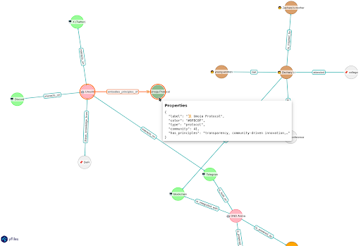


### Running the Code

First, download the [SQL Workflow](src/unstructured-graphrag-workflow.sql) code and run it inside a Snowflake Worsheet.

Next, download the [Notebook for Unstructured Data](src/unstructured-graphrag-kg.ipynb) and run it inside Snowflake.


## Predicting Transfer Transactions

Predicting transactions is essentially a link-prediction problem. For these kinds of problems, the state-of-the-art technique is using a Graph Neural Network (GNN). A GNN is a type of artificial neural network designed to process data that's structured as a graph. These networks use nodes and edges to represent relationships between entities and are used for tasks like node classification, edge prediction, and graph-level prediction.

You can see below a schematic of the data that we can use in this use case as well as a conceptual conversion of that data to a graph. In this case, we have nodes that are buyers and senders and edges that represent transactions in time:

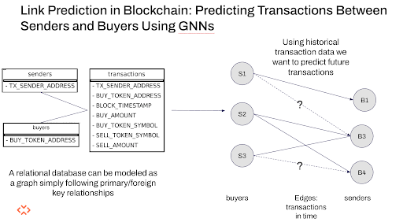

Given this formalization, our goal is to predict the transactions (i.e., the edges) that will happen at a later point in time.

To this end, we will utilize RelationalAI's GNN Native App. We start by extracting the necessary data for buyers, senders and transactions:


``` python
# setting up
buyers_pth = "GNN_DEMO_TF.TF_DATA.BUYERS"
senders_pth = "GNN_DEMO_TF.TF_DATA.SENDERS"
transactions_pth = "GNN_DEMO_TF.TF_DATA.TRANSACTIONS"
train_pth = "GNN_DEMO_TF.TF_LINK_PRED.TRAIN"
val_pth = "GNN_DEMO_TF.TF_LINK_PRED.VAL"
test_pth = "GNN_DEMO_TF.TF_LINK_PRED.TEST"

# We create three different tables, a table for the buyers a table
# for the senders and a table with the transactions between them
buyers_table = GNNTable(
    connector=connector,
    source=buyers_pth,
    name="buyers",
    primary_key="BUY_TOKEN_ADDRESS",
)

senders_table = GNNTable(
    connector=connector,
    source=senders_pth,
    name="senders",
    primary_key="TX_SENDER_ADDRESS",
)

transactions_table = GNNTable(
    connector=connector,
    source=transactions_pth,
    name="transactions",
    foreign_keys=[
        ForeignKey(
            column_name="TX_SENDER_ADDRESS", link_to="senders.TX_SENDER_ADDRESS"
        ),
        ForeignKey(column_name="BUY_TOKEN_ADDRESS", link_to="buyers.BUY_TOKEN_ADDRESS"),
    ],
    time_column="BLOCK_TIMESTAMP",
)
# modify column dtypes if needed
transactions_table.update_column_dtype(
    col_name="BUY_AMOUNT", dtype=ColumnDType.integer_t
)
transactions_table.update_column_dtype(
    col_name="SELL_AMOUNT", dtype=ColumnDType.integer_t
)
```

Next, we prepare the link prediction task:

```python
# our task is a classic link prediction task,
# we will predict if there exists an edge between
# senders and buyers.

link_pred_task = LinkTask(
    connector=connector,
    name="link_prediction_example",
    task_data_source={"train": train_pth, "test": test_pth, "validation": val_pth},
    source_entity_column="TX_SENDER_ADDRESS",
    source_entity_table="senders",
    target_entity_column="BUY_TOKEN_ADDRESS",
    targer_entity_table="buyers",
    task_type=TaskType.LINK_PREDICTION,
    time_column="BLOCK_TIMESTAMP",
    evaluation_metric=EvaluationMetric(name="link_prediction_map", eval_at_k=10),
)
```

Next, we create the dataset and visualize it:

```python

dataset = Dataset(
    connector=connector,
    dataset_name="tokenflow",
    tables=[buyers_table, transactions_table, senders_table],
    task_description=link_pred_task,
)

graph = dataset.visualize_dataset(show_dtypes=False)
graph.set_graph_defaults(size="50,50!")  # Increase graph size
plt = Image(graph.create_png(), width=600, height=600)
display(plt)
```

The dataset looks as follows:

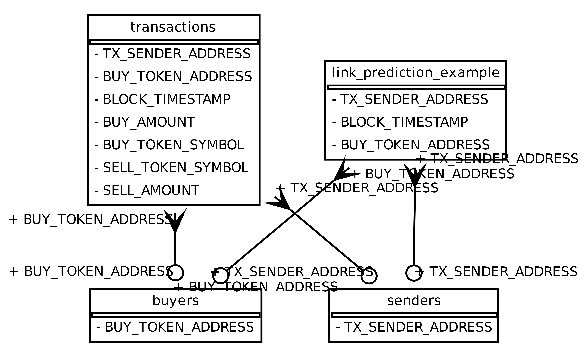


Finally, we train a GNN for this specific prediction task:

```python
# create the GNN model configuration
train_config = TrainerConfig(
    connector=connector,
    device="cuda",
    n_epochs=2,
    id_awareness=True,
    temporal_strategy="last",
    max_iters=2000,
    train_batch_size=128,
    shallow_embeddings_list=["buyers"],
    share_same_time=False,
)
# initialize the Trainer
trainer = Trainer(connector=connector, config=train_config)
```

Once completed, we can use the model to predict the links:

```python
output_config = OutputConfig.snowflake(
    database_name="GNN_DEMO_TF", schema_name="PUBLIC"
)

inference_job = trainer.predict(
    output_alias="EXP_1",
    output_config=output_config,
    dataset=dataset,
    test_batch_size=128,
    model_run_id=train_job_1.model_run_id,
)
```


### Running the Code

Download the [Link Prediction Notebook using GNNs](src/prediction-gnn.ipynb). Import into Snowflake and run.

## Detecting Anomalous Communities

Benford's Law describes the expected distribution of first digits in many real-world datasets. Transactions that deviate significantly from this distribution may indicate fraudulent or suspicious activity.

In [Chen and Tsourakakis](https://arxiv.org/pdf/2205.13426) The authors propose the AntiBenford Subgraph framework, which identifies dense subgraphs where the distribution of first digits of transaction amounts significantly deviates from Benford's Law.

In this use case, we start by doing some data exploration. At first, we examine the degree distribution of the network:

```python
with model.query() as select:
    node = directed_graph.Node()
    degree = directed_graph.compute.degree(node)
    indegree = directed_graph.compute.indegree(node)
    outdegree = directed_graph.compute.outdegree(node)
    node.set(degree = degree)
    response = select(node.node_id,  alias(degree, "degree"), alias(indegree, "indegree"), alias(outdegree, "outdegree"))

directed_node_stats_df = response.results

# Filter to only non-zero for log-scale plots
nonzero_deg = directed_node_stats_df[directed_node_stats_df['degree'] > 0]
nonzero_indeg = directed_node_stats_df[directed_node_stats_df['indegree'] > 0]
nonzero_outdeg = directed_node_stats_df[directed_node_stats_df['outdegree'] > 0]

fig, axs = plt.subplots(2, 2, figsize=(8, 4))

# 1. Degree distribution
degree_counts = nonzero_deg['degree'].value_counts().sort_index()
axs[0, 0].scatter(degree_counts.index, degree_counts.values, color='blue')
axs[0, 0].set_xscale('log')
axs[0, 0].set_yscale('log')
axs[0, 0].set_title('Degree Distribution')
axs[0, 0].set_xlabel('Degree (k)')
axs[0, 0].set_ylabel('Frequency')

# 2. Indegree distribution
indegree_counts = nonzero_indeg['indegree'].value_counts().sort_index()
axs[0, 1].scatter(indegree_counts.index, indegree_counts.values, color='green')
axs[0, 1].set_xscale('log')
axs[0, 1].set_yscale('log')
axs[0, 1].set_title('Indegree Distribution')
axs[0, 1].set_xlabel('Indegree (k)')
axs[0, 1].set_ylabel('Frequency')

# 3. Outdegree distribution
outdegree_counts = nonzero_outdeg['outdegree'].value_counts().sort_index()
axs[1, 0].scatter(outdegree_counts.index, outdegree_counts.values, color='orange')
axs[1, 0].set_xscale('log')
axs[1, 0].set_yscale('log')
axs[1, 0].set_title('Outdegree Distribution')
axs[1, 0].set_xlabel('Outdegree (k)')
axs[1, 0].set_ylabel('Frequency')

# 4. Indegree vs Outdegree scatter with annotations
axs[1, 1].scatter(directed_node_stats_df['indegree'], directed_node_stats_df['outdegree'], alpha=0.5)

axs[1, 1].set_xlabel('Indegree')
axs[1, 1].set_ylabel('Outdegree')
axs[1, 1].set_title('Indegree vs Outdegree')

plt.tight_layout()
plt.show()
```

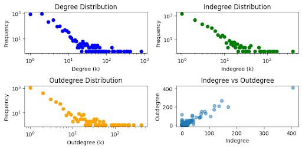

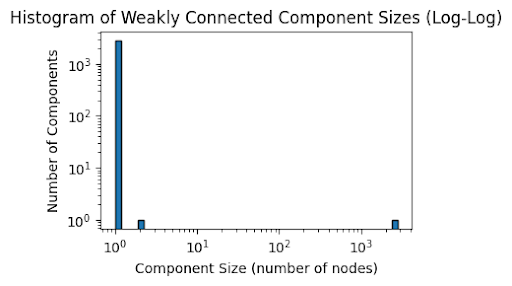

Next, we can compute the histogram of PageRank values:

```python
# Avoid log(0) by filtering out zero or near-zero values
nonzero_pagerank = pagerank_df[pagerank_df['pagerank'] > 0]['pagerank']
plt.figure(figsize=(6, 3))
plt.hist(nonzero_pagerank, bins=30, edgecolor='black', log=True)
plt.xscale('log')
plt.title('Log-Scaled Histogram of PageRank Values')
plt.xlabel('PageRank (log scale)')
plt.ylabel('Frequency (log scale)')
plt.show()
```

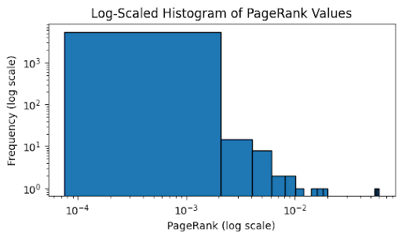

Next, we can hone in the egonet of the top-most node in terms of PageRank:

```python
# let's show the 1-hop network of the most central node according to PR
from relationalai.experimental.graphs import ego_network

with model.query() as select:
    node = directed_graph.Node()
    node.node_id == '0x57f25dd735ed502e46fb63af820297bf8409c703'
    a,b = ego_network(directed_graph, node, 1)
    ego_response = select(alias(node.node_id,"ego_node id"), alias(directed_graph.Node(a).node_id, "u"), alias(directed_graph.Node(b).node_id, "v"))

print(ego_response.results.head(3))
```

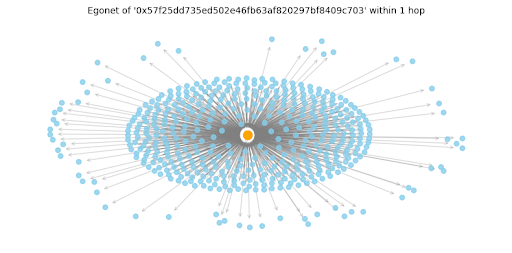


We then move on to detecting anomalous communities using Benford's law.
We begin by plotting the distribution of the community sizes detected in our dataset:

```python
community_sizes = infomap_df['community_label'].value_counts()

plt.figure(figsize=(8, 4))
plt.hist(community_sizes, bins=50, color='skyblue', edgecolor='black', log=True)

plt.xlabel("Community Size (number of nodes)")
plt.ylabel("Frequency (log scale)")
plt.title("Distribution of Community Sizes (Infomap)")
plt.grid(True, which='both', linestyle='--', linewidth=0.5)
plt.tight_layout()
plt.show()
```

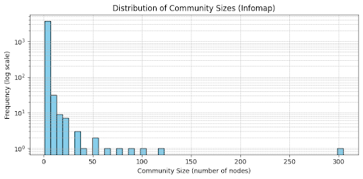

We can also plot the observed likelihood vs Bedford:

```python
# Plot observed vs Benford
    plt.figure(figsize=(6, 4))
    plt.bar(range(1, 10), digit_probs, alpha=0.6, label='Observed')
    plt.plot(range(1, 10), benford_probs, 'r--', marker='o', label='Benford')
    plt.xticks(range(1, 10))
    plt.xlabel("First Digit")
    plt.ylabel("Probability")
    plt.title(f"Community {label} (edges={len(weights)}), χ²={chi_stat:.2f}")
    plt.legend()
    plt.tight_layout()
    plt.show()
```

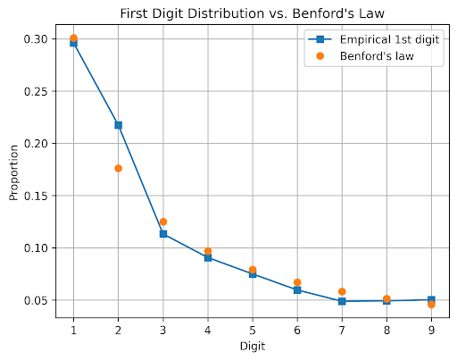


```python
visualize_community(induced_community_subgraphs, 22," (low chi^2 score, normal)") # normal
visualize_community(induced_community_subgraphs, 80," (high chi^2 score, anomalous)") #most anomalous
```


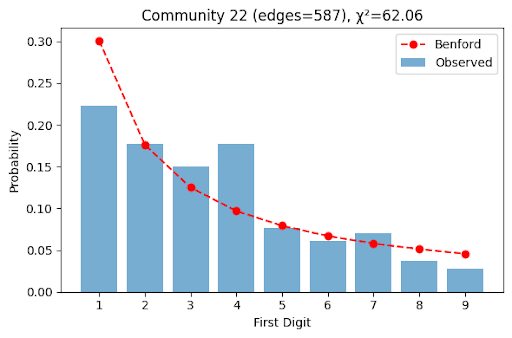

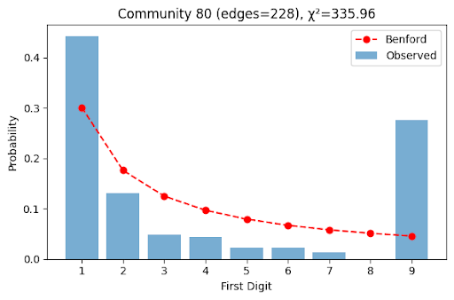

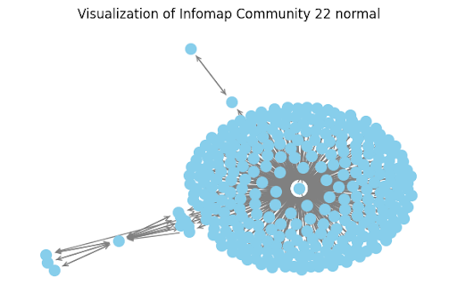


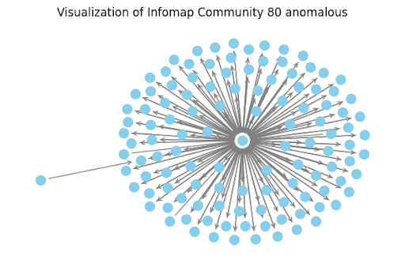

### Running the Code

Download the [egonets library](src/anomaly-install-egonets.py) and import into Snowflake.

Next, Download the [Anomalous Communities Notebook](src/anomaly-communities.ipynb), import and run into Snowflake.


## Conclusion

This tutorial used a sample dataset from Token Flow, combined with Relational AI's GenAI services through Snowflake, to explore four typical use cases relevant to AI Engineers and Data Scientists:

* Building a Knowledge Graph over Structured Data: Creates a semantic layer over structured data, turning basic data points into more meaningful, interconnected entities, improving both human and machine understanding.
* Building a Knowledge Graph over Unstructured Data: Transforms raw, unstructured text (like emails or reports) into structured, connected knowledge. This makes the data more usable for analysis and automation and allows users to query the data using natural language.
* Predicting Transfer Transactions: Utilizes historical blockchain data to predict future transaction behaviors. This is crucial for making proactive, data-driven decisions in various applications like forecasting sales or detecting fraud.
* Detecting Anomalies: Identifies abnormal patterns (e.g., fraud, failures, or collusion) within blockchain data. Early detection can prevent costly problems by highlighting suspicious activities, like anomalous communities of traders.

Each use case demonstrated how Relational AI's GenAI capabilities can leverage blockchain data to drive actionable insights in Decentralized Finance (DeFi) and beyond.


## Further Reading

* Video link?
*