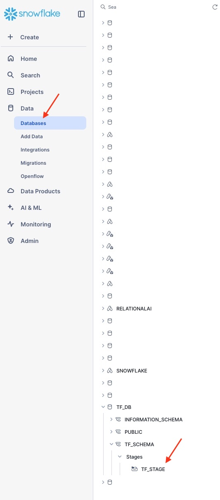
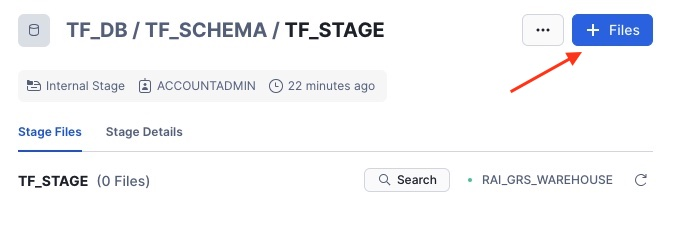
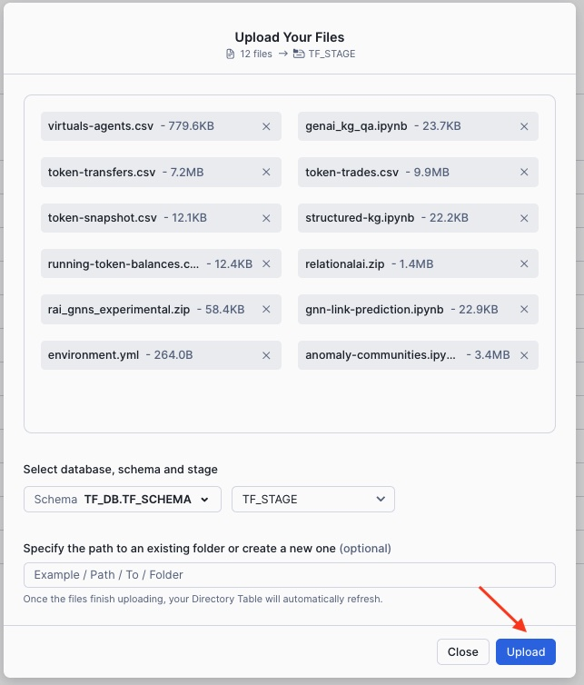
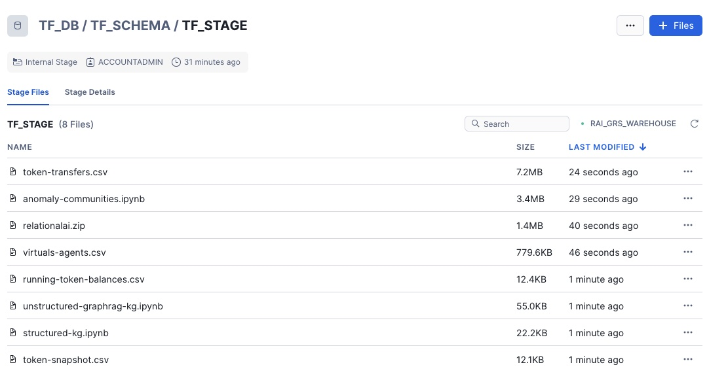
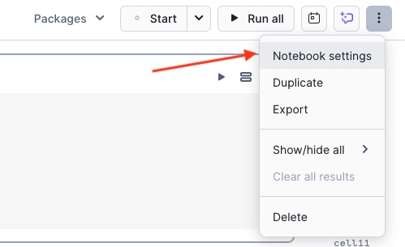
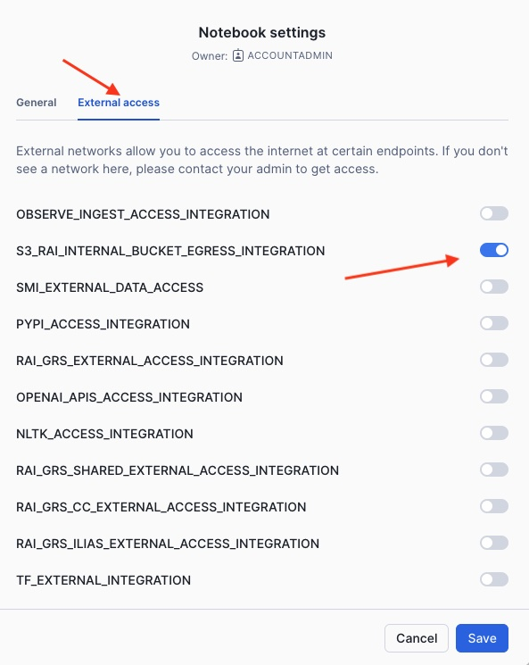
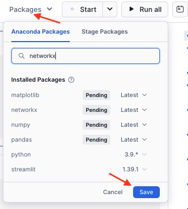
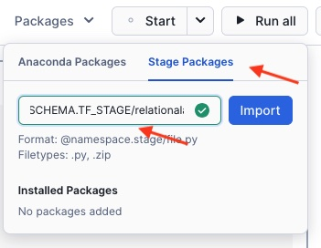

# Installation Instructions


In the following you will find installation instructions for the code of the different [Token Flow](https://tokenflow.live) use cases.


## Account (optional)

You will need an account on Snowflake. If you need to create (and have permissions to do so) a new account, you can run the [create_account.sql](setup/0_create_account.sql) script specifying the specific admin name, password, etc.

> [!NOTE]
> You do not need to create a new account if you already have one.

Here is an example of creating an account called `TOKENFLOW_DEV`:

```sql
CREATE ACCOUNT TOKENFLOW_DEV
    ADMIN_NAME = <EXISTING_USER_HERE>
    ADMIN_PASSWORD = '<PASSWORD_HERE>'
    EMAIL = '<EMAIL_HERE>'
    MUST_CHANGE_PASSWORD = FALSE
    EDITION = ENTERPRISE
    ;
```


## User (optional)

You will also need a user on the account. This user can be an existing user or you can create a new one (you can check out the [create_users.sql](setup/1_create_users.sql) script). Please ensure that you have logged into the account you will be using (e.g. with the `ADMIN_NAME` user specified above).


Here is an example of creating a new user `TOKENFLOW_ADMIN`.

```sql
USE ROLE ACCOUNTADMIN;

CREATE USER TOKENFLOW_ADMIN
    PASSWORD='<PASSWORD_HERE>'
    DEFAULT_ROLE = SYSADMIN
    DEFAULT_SECONDARY_ROLES = ('ALL')
    MUST_CHANGE_PASSWORD = FALSE
    LOGIN_NAME = TOKENFLOW_ADMIN
    DISPLAY_NAME = TOKENFLOW_ADMIN
    FIRST_NAME = TOKENFLOW_ADMIN
    LAST_NAME = TOKENFLOW_ADMIN
    ;

-- grant roles
GRANT ROLE ACCOUNTADMIN, SYSADMIN TO USER TOKENFLOW_ADMIN;

-- set default role to sysadmin
ALTER USER TOKENFLOW_ADMIN SET DEFAULT_ROLE=SYSADMIN;
```

## Getting Access to the Native Apps

For the use cases you will need to have access to two different RelationalAI Native Apps.
For both apps you can contact Nikolaos Vasiloglou `nik.vasiloglou@relational.ai` if you need assistance.

### RelationalAI Native App

You will need your account to have the [RAI Native App for Snowflake](https://docs.relational.ai/manage/install) installed. The link provides detailed instructions on how to install the App. Note that you will need to be a user with either `ORGADMIN` or `ACCOUNTADMIN` privileges and it requires notification from Relational AI as to when your access is enabled for your account. Please ensure to specify that you need access to the experimental version of the RelationalAI Native App which has both the `GNN` features available and the `PyRel` features.

### RelationalAI GraphRAG Native App

You will also need your account to have the RAI GraphRAG App for Snowflake installed. For this please contact your administrator or, send an email to the account above.


## Building the `relationalai.zip` Python Package

For certain use cases you will be working through a Snowflake Notebook. To this end, you will need a Python package that allows for interfacing between the Snowflake Notebooks. We will show you how and where to upload this package at a later step together with the code and the data.

> [!NOTE]
> You may ask a RelationalAI representative to give you this file if you don't have access to the source code. For your convenience a version has been provided in the [/for_stage](/for_stage/) folder but it is advisable to ask a RelationalAI representative for the latest version.

You can build this package following the steps below in a shell. You will need `Python >= 3.9` and `pip` installed for the following to work.


```sh
# clone the code
git clone https://github.com/RelationalAI/relationalai-python

cd relationalai-python

# create a virtual environment
python -m venv .venv
source .venv/bin/activate  # On Windows use `.venv\Scripts\activate`

pip install --upgrade pip
pip install -r requirements.lock

rai-dev build        # Build the package (creates wheel and sdist)
rai-dev build:zip    # Build the Snowflake notebook zip file

deactivate
```

Once the building completes you will now have a file called `relationalai.zip` in the current folder. Keep this file as we will upload it later on to a Snowflake stage.


## Building the `rai_gnns_experimental.zip` package

Similarly, for certain use cases that you'll be working through the Snowflake Notebook you will need to access certain RelationalAI services through the GNN Python SDK. To this end, you will need the `rai_gnns_experimental.zip` file.b

> [!NOTE]
> You may ask a RelationalAI representative to give you this file if you don't have access to the source code. For your convenience a version has been provided in the [/for_stage](/for_stage/) folder but it is advisable to ask a RelationalAI representative for the latest version.

You can build this package following the steps below in a shell.

```sh
git clone https://github.com/RelationalAI/gnn-learning-engine.git

cd gnn-learning-engine

zip -r rai_gnns_experimental rai_gnns_experimental
```

Once this process completes, you will now have a file called `rai_gnns_experimental.zip` in the current folder. Keep this file as we will upload it later on to a Snowflake stage.

## Set up Database Objects

In the following steps you will be creating Snowflake Database Objects such as a warehouse, schema, stage, etc.

### Specify Object Names

You can decide on the names that you'd like to use and set them up in variables in the beginning, so that the rest of the code below can create the objects.

> [!NOTE]
> You will need to run the following in a Snowflake SQL worksheet. You can find all the code in one place in the [create_assets.sql](setup/2_create_assets.sql) file.

Here is an example of the configuration of names for database, warehouse, stage, etc

```sql
USE ROLE ACCOUNTADMIN;

-- set up of constants, change the names in this section of what assets you'd like to create,
-- no need to touch the rest of the code

SET db_name = 'tf_db';
SET schema_name = 'tf_schema';
SET schema_full_name = $db_name||'.'||$schema_name; -- fully-qualified
SET stage_name = 'tf_stage'; -- fully-qualified
SET stage_full_name = $schema_full_name||'.'||$stage_name;
SET wh_name = 'tf_wh';
SET wh_size = 'X-SMALL';
SET role_name = 'SYSADMIN';   -- what role will have access to the db/warehouse/schema etc.
```


### Cleanup and Create Role
The following cleans up by removing the database and warehouse for a fresh installation.

```sql
--
-- NOTE: in the following everything is DROPPED and re-created
--

-- cleanup
DROP DATABASE IF EXISTS identifier($db_name);
DROP WAREHOUSE IF EXISTS identifier($wh_name);

-- create role if needed
CREATE ROLE IF NOT EXISTS identifier($role_name);
```


### Create a Database

Next, you will create a database:

```sql
-- create a database
CREATE DATABASE IF NOT EXISTS identifier($db_name);
GRANT OWNERSHIP ON DATABASE identifier($db_name) TO ROLE identifier($role_name) COPY CURRENT GRANTS;
USE DATABASE identifier($db_name);
```


### Create a Warehouse

Next, you will create a warehouse:

```sql
-- create warehouse
CREATE OR REPLACE WAREHOUSE identifier($wh_name) WITH WAREHOUSE_SIZE = $wh_size;
GRANT USAGE ON WAREHOUSE identifier($wh_name) TO ROLE identifier($role_name);
```


### Create a Schema

You can create a schema as follows:

```sql
-- create a schema
CREATE SCHEMA IF NOT EXISTS identifier($schema_full_name);
GRANT USAGE ON SCHEMA identifier($schema_full_name) TO ROLE identifier($role_name);
USE SCHEMA identifier($schema_full_name);
```


### Create a Stage

You will need the stage to upload the Python Notebooks as well as the raw csv data that will then imported into Snowflake Tables. You can create a stage as follows:

```sql
-- create a stage
CREATE STAGE IF NOT EXISTS identifier($stage_full_name) DIRECTORY = ( ENABLE = true );
GRANT READ ON STAGE identifier($stage_full_name) TO ROLE identifier($role_name);
```


### Enable User to Create Notebooks

Depending on the role used for accessing the database, you may need to grant the user certain privileges to allow creation of notebooks. You can grant the privilege as follows:

```sql
-- privilege for notebook
GRANT CREATE NOTEBOOK ON SCHEMA identifier($schema_full_name) TO ROLE identifier($role_name);
```


## Upload Code and Data to the Stage

Once you have created the database, schema and stage you will now need to upload the necessary files to the stage that we can insert the data into Snowflake tables for further processing and create the notebooks for the use cases.

For this you need to login into Snowsight, and, on the left, click on `Data > Databases`.
After that, find the database that you have just created, and select the schema, stages and then the stage that you created. In our example you would be clicking on `TF_DB > TF_SCHEMA > Stages > TF_STAGE` as shown in the picture:


<picture>
  
</picture>


Next you will need to add some files. For this you need to click on the `Files` button on the top right:

<picture>
  
</picture>

In the following window you will need to upload the following files:

1. [unstructured-graphrag-kg.ipynb](for_stage/unstructured-graphrag-kg.ipynb)
2. [anomaly-communities.ipynb](for_stage/anomaly-communities.ipynb)
3. [structured-kg.ipynb](for_stage/structured-kg.ipynb)
4. [running-token-balances.csv](for_stage/running-token-balances.csv)
5. [token-snapshot.csv](for_stage/token-snapshot.csv)
6. [virtuals-agents.csv](for_stage/virtuals-agents.csv)
7. [relationalai.zip](for_stage/relationalai.zip)
8. [token-transfers.csv](for_stage/token-transfers.csv)

[`environment.yml`](for_stage/environment.yml)
[unstructured-graphrag-kg.ipynb](for_stage/unstructured-graphrag-kg.ipynb)
[gnn-link-prediction.ipynb](for_stage/gnn-link-prediction.ipynb)
[rai_gnns_experimental.zip](for_stage/rai_gnns_experimental.zip)
[token-trades.csv](for_stage/token-trades.csv)
[anomaly-communities.ipynb](for_stage/anomaly-communities.ipynb)
[structured-kg.ipynb](for_stage/structured-kg.ipynb)
[running-token-balances.csv](for_stage/running-token-balances.csv)
[token-snapshot.csv](for_stage/token-snapshot.csv)
[virtuals-agents.csv](for_stage/virtuals-agents.csv)
[relationalai.zip](for_stage/relationalai.zip)
[token-transfers.csv](for_stage/token-transfers.csv)


You can select them and drag and drop them on the window that opened. For your convenience all of these files are already located in the [for_stage/](/for_stage/) folder in the current repository.

Once you dragged and dropped the files click on the `upload` button.

<picture>
  
</picture>

Your stage will now look something like this:

<picture>
  
</picture>


## Load the Data into Snowflake Tables

Once you have all the files in the stage you can now go ahead and import the data into Snowflake tables.

For this you need to run the following commands in a Snowflake SQL Worksheet. For your convenience, all of the code is located in [import_data.sql](setup/3_import_data.sql).

```sql
--
-- data
--
USE ROLE ACCOUNTADMIN;
USE DATABASE TF_DB;
USE SCHEMA TF_SCHEMA;

-- token-transfers.csv
CREATE OR REPLACE TABLE TOKEN_TRANSFERS (
    LAUNCHPAD VARCHAR,
    TOKEN VARCHAR,
    SYMBOL VARCHAR,
    NAME VARCHAR,
    BLOCK_NUMBER NUMBER,
    BLOCK_TIMESTAMP DATETIME,
    TX_HASH VARCHAR,
    FROM_ADDRESS VARCHAR,
    L1_FEE NUMBER,
    L2_FEE NUMBER,
    SENDER VARCHAR,
    RECEIVER VARCHAR,
    AMOUNT NUMBER
);

ALTER TABLE TF_DB.TF_SCHEMA.TOKEN_TRANSFERS SET CHANGE_TRACKING = TRUE;

COPY INTO TOKEN_TRANSFERS
    from '@"TF_DB"."TF_SCHEMA"."TF_STAGE"/token-transfers.csv'
    FILE_FORMAT = (
        TYPE = CSV
        --COMPRESSION = BZ2
        SKIP_HEADER = 1
        NULL_IF = '\\N'
        EMPTY_FIELD_AS_NULL = TRUE
        DATE_FORMAT = AUTO --'YYYY-MM-DD HH:MM:SS'
        FIELD_OPTIONALLY_ENCLOSED_BY = '"'
        ESCAPE = '\\'
    )
    ON_ERROR = CONTINUE
;


-- virtuals-agents.csv
CREATE OR REPLACE TABLE VIRTUALS_AGENTS (
    AGENT_TOKEN_ADDRESS VARCHAR,
    NAME VARCHAR,
    SYMBOL VARCHAR,
    DESCRIPTION VARCHAR,
    CREATED_AT DATETIME,
    LP VARCHAR,
    TBA VARCHAR,
    WALLETS VARCHAR,
    IS_PUBLIC BOOLEAN,
    IS_PREMIUM BOOLEAN,
    X_USERNAME VARCHAR,
    STATUS VARCHAR,
    EXTRA_DATA VARCHAR,
    ADDED_AT DATETIME
);

ALTER TABLE TF_DB.TF_SCHEMA.VIRTUALS_AGENTS SET CHANGE_TRACKING = TRUE;

COPY INTO VIRTUALS_AGENTS
    from '@"TF_DB"."TF_SCHEMA"."TF_STAGE"/virtuals-agents.csv'
    FILE_FORMAT = (
        TYPE = CSV
        SKIP_HEADER = 1
        NULL_IF = '\\N'
        EMPTY_FIELD_AS_NULL = TRUE
        DATE_FORMAT = AUTO --'YYYY-MM-DD HH:MM:SS'
        FIELD_OPTIONALLY_ENCLOSED_BY = '"'
        ESCAPE = '\\'
    )
    ON_ERROR = CONTINUE
;


-- token-snapshot.csv
CREATE TABLE TOKEN_SNAPSHOT (
    NAME VARCHAR,
    TOKEN_ADDRESS VARCHAR,
    SNAPSHOT_TIME DATETIME,
    TRANSFER_COUNT NUMBER,
    TRANSFER_AMOUNT NUMBER,
    BUY_COUNT NUMBER,
    BUY_AMOUNT NUMBER,
    SELL_COUNT NUMBER,
    SELL_AMOUNT NUMBER,
    MINT_COUNT NUMBER,
    MINT_AMOUNT NUMBER,
    BURN_COUNT NUMBER,
    BURN_AMOUNT NUMBER,
    TOTAL_SUPPLY NUMBER,
    HOLDER_COUNT NUMBER,
    USD_PRICE NUMBER,
    TVL NUMBER
);

ALTER TABLE TF_DB.TF_SCHEMA.TOKEN_SNAPSHOT SET CHANGE_TRACKING = TRUE;

COPY INTO TOKEN_SNAPSHOT
    from '@"TF_DB"."TF_SCHEMA"."TF_STAGE"/token-snapshot.csv'
    FILE_FORMAT = (
        TYPE = CSV
        SKIP_HEADER = 1
        NULL_IF = '\\N'
        EMPTY_FIELD_AS_NULL = TRUE
        DATE_FORMAT = AUTO --'YYYY-MM-DD HH:MM:SS'
        FIELD_OPTIONALLY_ENCLOSED_BY = '"'
        ESCAPE = '\\'
    )
    ON_ERROR = CONTINUE
;


-- running-token-balances.csv
CREATE TABLE RUNNING_TOKEN_BALANCES (
    TOKEN_ADDRESS VARCHAR,
    HOLDER VARCHAR,
    BALANCE_CHANGE_TIME DATETIME,
    RUNNING_BALANCE NUMBER
);

ALTER TABLE TF_DB.TF_SCHEMA.RUNNING_TOKEN_BALANCES SET CHANGE_TRACKING = TRUE;

COPY INTO RUNNING_TOKEN_BALANCES
    from '@"TF_DB"."TF_SCHEMA"."TF_STAGE"/running-token-balances.csv'
    FILE_FORMAT = (
        TYPE = CSV
        SKIP_HEADER = 1
        NULL_IF = '\\N'
        EMPTY_FIELD_AS_NULL = TRUE
        DATE_FORMAT = AUTO --'YYYY-MM-DD HH:MM:SS'
        FIELD_OPTIONALLY_ENCLOSED_BY = '"'
        ESCAPE = '\\'
    )
    ON_ERROR = CONTINUE
;
```


## Create Notebooks

Next, you will create the notebooks based on the `.ipynb` sources that you uploaded on stage.

You can do this by running the following commands in a Snowflake Worksheet.
For your convenience, the whole code is available in [create_notebooks.sql](setup/4_create_notebooks.sql).

```sql
--
-- notebooks
--
USE ROLE ACCOUNTADMIN;
USE DATABASE TF_DB;
USE SCHEMA TF_SCHEMA;


-- anomaly-communities.ipynb
CREATE OR REPLACE NOTEBOOK anomaly_communities
    FROM '@tf_db.tf_schema.tf_stage'
    MAIN_FILE = 'anomaly-communities.ipynb'
    QUERY_WAREHOUSE = $wh_name
    WAREHOUSE = $wh_name
    ;

-- structured-kg.ipynb
CREATE OR REPLACE NOTEBOOK structured_kg
    FROM '@tf_db.tf_schema.tf_stage'
    MAIN_FILE = 'structured-kg.ipynb'
    QUERY_WAREHOUSE = $wh_name
    WAREHOUSE = $wh_name
    ;
```

### Setting up Packages and External Access for the Notebooks


> [!NOTE]
> You need to do the following for every notebook that you would like to use

#### External Access

Once you have created the notebooks, you need to set up external access for them.
This is needed by the RelationalAI Native App in order to communicate with the RelationalAI backend.

More specifically, you will need to enable the `S3_RAI_INTERNAL_BUCKET_EGRESS_INTEGRATION`.

For this, you need to click on the `...` on the top right of the page when viewing a Notebook and then on `Notebook settings`:

<picture>
  
</picture>

Next, you need to click on the  toggle-on the `External access` tab on top and toggle the `S3_RAI_INTERNAL_BUCKET_EGRESS_INTEGRATION` to on. Next click `Save`.

<picture>
  
</picture>


#### Loading Python Packages

The Notebooks containing the code for the various use cases use some Python packages.
These packages need to be installed before the Notebook can run.

To install such packages you should click on the top `Packages` and then type the name of each package in the`Anaconda Packages` search box and selecting the package. You should install the following packages:

* `certifi`
* `cryptography`
* `gravis`
* `matplotlib`
* `networkx`
* `numpy`
* `pandas`
* `pydantic`
* `pydot`
* `python-dotenv`
* `python-graphviz`
* `sqlalchemy`
* `tabulate`

<picture>
  
</picture>

Next, click `Save` for the packages to be installed.

#### Loading the `relationalai.zip` and `rai_gnns_experimental.zip` Python Packages

Finally, you will need to install the `relationalai.zip` Python package that is needed to
interface with the RelationalAI Native App. The process is somewhat similar with the regular Python packages that
you just installed, except you will be clicking on the `Stage Packages` tab on top and specifying the path to the `relationalai.zip` package.

The path needs to be fully qualified. For example `@TF_DB.TF_SCHEMA.TF_STAGE/relationalai.zip` and `@TF_DB.TF_SCHEMA.TF_STAGE/rai_gnns_experimental.zip`:

<picture>
  
</picture>

The system checks whether the path contains a valid Python package and, if yes, a green check box appears.
Click `Import` to import the `relationalai.zip` package.


## Completed

You can now pick a Python Notebook from the Notebooks section on the left in Snowsight and run it!


