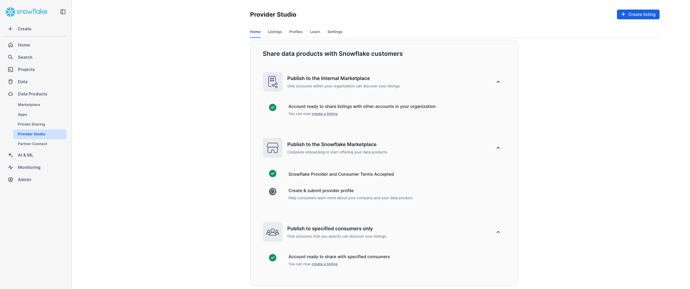
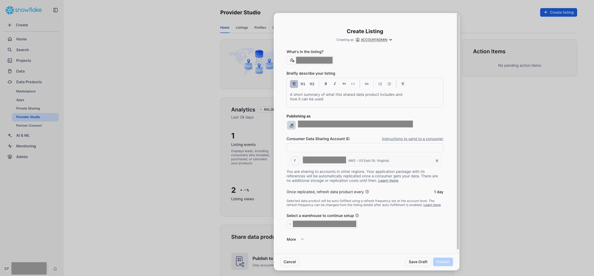

## Sharing the native app with specific consumers 

### Prerequisites

For sharing the native app package for installation on accounts external to the app provider account, the following steps must be followed.

1. Usage of role `ACCOUNTADMIN` is required.

2. Set the app package release channels

The release channels for the app package must be enabled: 

```sql
ALTER APPLICATION PACKAGE <package name> SET ENABLE_RELEASE_CHANNELS = TRUE;
```

A default release directive must be set for release channel `DEFAULT`. This is an invariant setting that has to be present for the app package. 

```sql
ALTER APPLICATION PACKAGE <package name>
    MODIFY RELEASE CHANNEL DEFAULT
    ADD VERSION <app version>;

-- Set the default release directive for channel `DEFAULT`.
ALTER APPLICATION PACKAGE <package name>
  MODIFY RELEASE CHANNEL DEFAULT
  SET DEFAULT RELEASE DIRECTIVE VERSION = <app version>
  PATCH = <app patch number>;
```

Optionally, the default release directive for the `ALPHA` channel can be set:

```sql
ALTER APPLICATION PACKAGE <package name>
    MODIFY RELEASE CHANNEL ALPHA
    ADD VERSION <app version>;

-- Set the default release directive for channel `ALPHA`.
ALTER APPLICATION PACKAGE <package name>
  MODIFY RELEASE CHANNEL ALPHA
  SET DEFAULT RELEASE DIRECTIVE VERSION = <app version>
  PATCH = <app patch number>;
```

You may list the release directives for the app package using the following statement:

```sql
-- List the release directives for the app package.
SHOW RELEASE DIRECTIVES IN APPLICATION PACKAGE <package name>;
```

3. The Snowflake account `ORGADMIN` must have accepted the terms and conditions, as shown below:



4. The app package must undergo a Snowflake security evaluation. This is a requirement for all app packages that are shared with external accounts, outside the Snowflake Marketplace. The app package must be submitted for review by filling out the [Native Apps Security Questionnaire](https://docs.google.com/forms/d/1XLjbcSrp689kXEvVELa6KbEUOPfsJIirSTG5pGQDMZE/viewform?ts=65fb4866&edit_requested=true). More information can be found on [Secure a Snowflake Native App with Snowpark Container Services](https://docs.snowflake.com/en/developer-guide/native-apps/security-na-spcs).

5. The app package distribution must be set to `EXTERNAL`. This setting is allowed only if the app package has passed the security review process, otherwise the statement will fail. 

```sql
-- Set the app package distribution to `EXTERNAL`.
ALTER APPLICATION PACKAGE <package name>
SET DISTRIBUTION = EXTERNAL;
```

6. For sharing the app across Snowflake regions, the `ORGADMIN` role must provide the `ACCOUNTADMIN` role a privilege by setting the following parameter:

```sql
SYSTEM$ENABLE_GLOBAL_DATA_SHARING_FOR_ACCOUNT('<account name>')
```

### Creating a share

Sharing the application happens through the Snowflake Provider Studio. The app provider can create a share for "Specified Consumers" and add the app package to the share. The share can then be shared with specific consumers:

1. Create a share for "Specified Consumers" in the Snowflake Provider Studio.


2. Add the app package to share, its description and the third-party consumer account identifier that the app package will be shared with:

